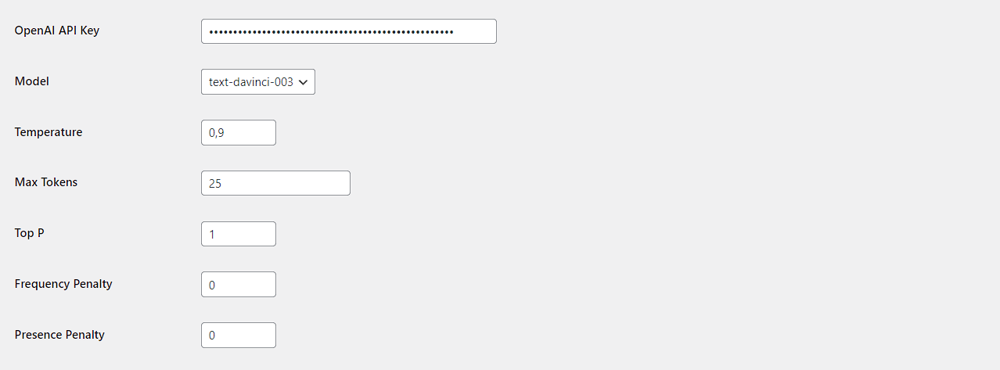
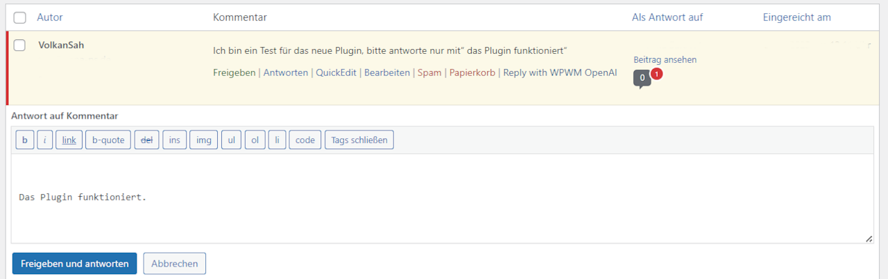

# Comments Reply with ChatGPT(OpenAi) 1.0.0 - WordPress Plugin (Davinci-3)
###### WordPress Plugins by Volkan Sah - Simple codings

## Description

WPWMs - Comments Reply with ChatGPT(OpenAi) is a plugin that uses OpenAI's ChatGPT to automatically reply to comments on your WordPress website. The plugin adds a "Reply with WPWM OpenAI" button to the comment line actions, which when clicked, sends the comment text to OpenAI's ChatGPT API and returns a suggested response.

## Table of Contents
- [Installation](#Installation)
- [Plugin Options and Settings](#plugin-options-and-settings)
- [Limitations](#Limitations)
- [License](#License)
- [Disclaimer](#Disclaimer)
- [Copyright](#Copyright)
- [Screenshots](#Screenshots)

## Installation

1. Upload the plugin files to the `/wp-content/plugins/WordPress-ChatGPT-Comments-Reply/core.php` directory, or install the plugin through the WordPress plugins screen directly.
2. Activate the plugin through the 'Plugins' screen in WordPress.
3. Use the Settings->WPWM OpenAI Settings screen to configure the plugin. You will need to provide an OpenAI API key to use the plugin.
4. Use the "Reply with WPWM OpenAI" button to generate automatic replies to comments on your WordPress website.

## Plugin Options and Settings

The plugin allows you to configure the following settings:

- OpenAI API Key: Enter your OpenAI API key here to use the plugin.
- Model: The default model is 'text-davinci-003' (best)
- Temperature: Set the temperature parameter to control the creativity of the generated replies. The default temperature is 0.9.
- Max Tokens: Set the maximum number of tokens to generate for the reply. The default value is 100.
- Top P: Set the top-p parameter to control the diversity of the generated replies. The default value is 1.
- Frequency Penalty: Set the frequency penalty parameter to control the likelihood of the same word being repeated in the generated replies. The default value is 0.0.
- Presence Penalty: Set the presence penalty parameter to control the likelihood of the same word being present in the generated replies. The default value is 0.0.

## Limitations

- The plugin requires an OpenAI API key to function.
- The quality of the generated replies may vary depending on the quality of the input comment and the chosen OpenAI model and parameters.
- The plugin does not guarantee the accuracy or appropriateness of the generated replies and the website owner is responsible for reviewing and moderating the comments and generated replies.

However, please keep in mind that creating and maintaining plugins or code for free, requires time and effort. If you find this plugin useful, please consider buying me a coffee, sponsoring my work on GitHub, or leaving a review, a "STAR" or follow me :smile:

## Disclaimer

This plugin uses OpenAI's API, which is a third-party service. Please review OpenAI's terms of service and ensure you comply with their usage policies. The plugin author is not responsible for any misuse or violation of OpenAI's terms of service.

### Thank you for your support!
- If you appreciate my work, please consider [becoming a 'Sponsor'](https://github.com/sponsors/volkansah), giving a :star: to my projects, or following me. 
### Credits
- [VolkanSah on Github](https://github.com/volkansah)
- [Developer Site](https://volkansah.github.io)

### License

"This work is licensed under a Creative Commons Attribution 4.0 International License. You are free to share, adapt, and build upon this work for any purpose, even commercially, as long as you give appropriate credits to Volkan Sah, see[License-Text](LICENSE.txt)

### Screenshots
##### Option-Page

##### Comments reply

